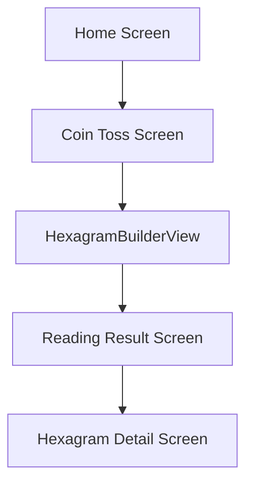

# Feature 04: Screen Integration

**Priority:** Medium  
**Dependencies:** `01-data-models`, `02-stroke-animation`, `03-coin-toss-hex-build`  
**Estimated Effort:** Medium

---

## Overview

Wire up the hexagram feature into the app's reading flow and result screens.

## Files to Modify

| File | Location | Changes |
|------|----------|---------|
| `reading_result_screen.dart` | `lib/screens/` | Display animated hexagram |
| `main.dart` | `lib/` | Add routes for new screens |

## Files to Create

| File | Location | Purpose |
|------|----------|---------|
| `hexagram_detail_screen.dart` | `lib/screens/` | Full hexagram reading display |
| `coin_toss_screen.dart` | `lib/screens/` | Optional coin animation screen |

---

## Screen Flow

---

## Implementation Details

### Reading Result Screen Updates

- Integrate `HexagramBuilderView` for animated reveal
- Display primary hexagram with stroke animation
- Show future hexagram if changing lines exist
- Link to detail screen for full text

### Hexagram Detail Screen

- Display hexagram number, name, Chinese name
- Show judgment and image texts
- List all 6 lines with their texts
- Highlight changing lines with special styling

---

## Acceptance Criteria

- [ ] User can navigate from home to coin toss
- [ ] Hexagram builds with animation
- [ ] Result screen shows primary + future hexagrams
- [ ] Detail screen displays all metadata
- [ ] Changing lines are visually distinct
