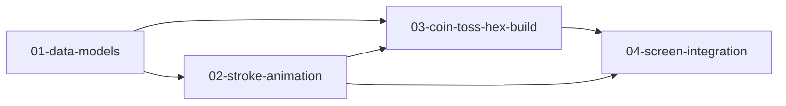

# Hexagram Feature - Implementation Overview

This directory contains the modular implementation plan for the Hexagram feature.

## Features

| # | Feature | File | Description |
|---|---------|------|-------------|
| 1 | Data Models | [01-data-models.md](01-data-models.md) | Hexagram, Line, and Repository models |
| 2 | Stroke Animation | [02-stroke-animation.md](02-stroke-animation.md) | Line-by-line reveal animation widget |
| 3 | Coin Toss & Hex Build | [03-coin-toss-hex-build.md](03-coin-toss-hex-build.md) | Coin toss logic and hexagram builder |
| 4 | Screen Integration | [04-screen-integration.md](04-screen-integration.md) | Reading flow and screen wiring |

## Dependency Map

See [dependencies.md](dependencies.md) for the full dependency graph.

## Execution Order

1. **Sequential (Foundation)**
   - `01-data-models` must complete first

2. **Parallel (Components)**
   - `02-stroke-animation` and `03-coin-toss-hex-build` can run in parallel after data models

3. **Sequential (Assembly)**
   - `04-screen-integration` requires all previous features
