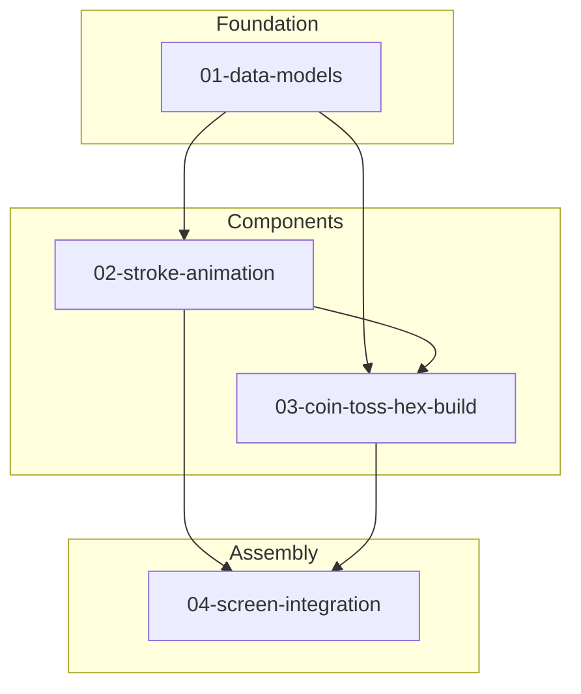

# Feature Dependencies

## Dependency Graph



---

## Execution Matrix

| Feature | Depends On | Blocks |
|---------|------------|--------|
| 01-data-models | — | 02, 03 |
| 02-stroke-animation | 01 | 03, 04 |
| 03-coin-toss-hex-build | 01, 02 | 04 |
| 04-screen-integration | 01, 02, 03 | — |

---

## Parallel Execution Opportunities

### Phase 1: Foundation (Sequential)
- `01-data-models` — **must complete first**

### Phase 2: Components (Parallel)
After Phase 1, these can run in parallel:
- `02-stroke-animation`
- `03-coin-toss-hex-build` (partial — can start models, needs animation for integration)

### Phase 3: Assembly (Sequential)
- `04-screen-integration` — requires all above

---

## Critical Path

```
01-data-models → 02-stroke-animation → 03-coin-toss-hex-build → 04-screen-integration
```

**Estimated Total Time:** 4 development cycles

---

## Risk Areas

| Risk | Mitigation |
|------|------------|
| Animation performance | Profile on low-end devices early |
| JSON loading latency | Preload repository at app start |
| State management | Consider Riverpod/Provider for hex state |
